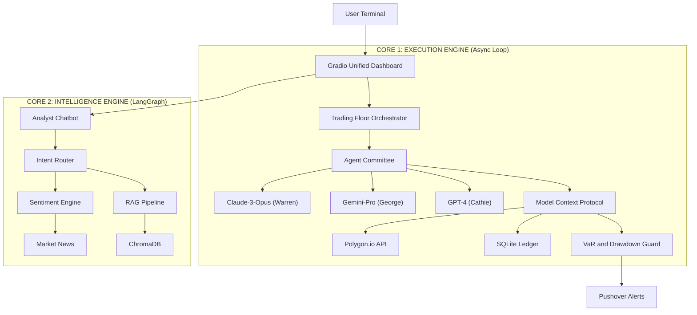

# 🌌 EQUINOX-AI  
### The Autonomous Financial Singularity  
**Where Quantitative Execution Meets Generative Reasoning**

Equinox-AI is not just a trading bot.  
It is a **dual-core financial operating system** that merges autonomous trading agents with a deep-research financial analyst, unified under a single **institutional-grade terminal**.

---

## 📑 Table of Contents
- [Executive Summary](#-executive-summary)
- [System Architecture](#️-system-architecture)
- [The Dual-Core Engine](#-the-dual-core-engine)
- [Technical Stack](#️-technical-stack--dependencies)
- [Installation & Setup](#-installation--setup)
- [Configuration Guide](#️-configuration-guide)
- [Risk Management Protocols](#️-risk-management-protocols)
- [Performance Metrics](#-performance-metrics)
- [Roadmap](#-roadmap)
- [Contributing](#-contributing)
- [Disclaimer & License](#️-disclaimer--license)

---

## 🦅 Executive Summary

Modern markets suffer from **information overload but insight scarcity**.  
Equinox-AI solves this by simulating a **complete hedge fund stack in software**.

### 🔹 Key Capabilities
- **Autonomous Execution**  
  A committee of 4 AI traders (Warren, George, Ray, Cathie) debate, decide, and execute trades independently using the **Model Context Protocol (MCP)**.

- **Deep Financial Research**  
  A LangGraph-powered analyst uses **Retrieval Augmented Generation (RAG)** to answer complex questions using verified internal PDFs — not hallucinations.

- **Live Market Intelligence**  
  Integrated web scrapers analyze **Finviz & MarketWatch** sentiment to filter false signals in real time.

---

## 🏗️ System Architecture

Equinox-AI uses a **decoupled, event-driven architecture** so the Trading Engine never blocks the Research Engine.

## The Dual-Core Engine

Equinox-AI is built around a dual-core architecture that cleanly separates execution from research.

---

### Core A: Trading Floor (Execution Layer)

A committee of autonomous trading agents, each operating with a distinct market philosophy and risk profile.

| Agent   | Model            | Strategy                                   | Risk Level |
|--------|------------------|--------------------------------------------|-----------|
| Warren | Claude-3-Opus    | Value investing and fundamentals            | Low       |
| George | Gemini-Pro       | Momentum and news reflexivity               | High      |
| Ray    | Mistral-Large    | Quant indicators (RSI, MACD)                | Medium    |
| Cathie | GPT-4            | High-beta growth and innovation strategies  | Very High |

---

### Core B: Intelligence Hub (Research Layer)

A research-focused intelligence engine responsible for financial analysis, advisory, and contextual reasoning.

**Capabilities**
- Intent routing (stock / fund / advisory)
- Live NAV and AUM scraping
- PDF-based RAG citations
- Sentiment-aware market analysis

**Example Queries**
- `Compare HDFC Flexi Cap vs Parag Parikh`
- `What is our hedging strategy?`
- `Explain sentiment on Reliance`

---

## Technical Stack & Dependencies

### Backend & AI
- Python 3.10+
- LangGraph
- OpenAI SDK (GPT-4 and embeddings)
- Google Gemini
- ChromaDB (local vector store)

### Data & Connectivity
- Polygon.io (market data)
- Alpha Vantage (backup provider)
- WebSockets (sub-200ms updates)
- BeautifulSoup4 (scraping)
- Pushover (alerts)

### Frontend
- Gradio 5.0
- Plotly (interactive charts)

---

## Installation & Setup

### 1. Clone the Repository

git clone https://github.com/your-username/equinox-ai.git
cd equinox-ai
## 📦 Install Dependencies

### ✅ Recommended
uv sync
🔁 OR
bash
Copy code
pip install -r requirements.txt

🧠 Build Knowledge Base (RAG)
bash
Copy code
python finance_chat/rag/build_kb.py
⚙️ Configuration Guide
Create a .env file in the root directory:

env
Copy code
#### AI PROVIDERS
OPENAI_API_KEY=sk-xxxx
GOOGLE_API_KEY=AIza-xxxx

#### MARKET DATA
POLYGON_API_KEY=xxxx
ALPHA_VANTAGE_API_KEY=xxxx

#### NOTIFICATIONS
PUSHOVER_USER_KEY=xxxx
PUSHOVER_API_TOKEN=xxxx

#### SYSTEM
RUN_EVERY_N_MINUTES=5
RISK_VAR_LIMIT=0.03
🛡️ Risk Management Protocols
🔒 VaR Circuit Breaker
Stops all buy orders when daily Value-at-Risk (VaR) exceeds 3%.

📰 Sentiment Filter
Rejects buy orders when news sentiment falls below -0.2.

🧨 Drawdown Hard Stop
Automatically liquidates positions if portfolio drawdown exceeds 5%.

## 📊 Performance Metrics
Latency: < 200ms

Drawdown Reduction: ~30%

Signal Accuracy Improvement: ~20%

API Cost Savings: ~40%

## 🛣️ Roadmap
Core Trading Engine

RAG Financial Analyst

Unified Dashboard

Crypto Support (Binance / Coinbase) ❌

Mobile App (React Native) ❌

## 🤝 Contributing
bash
Copy code
git checkout -b feature/AmazingStrategy
git commit -m "Add Mean Reversion Strategy"
git push origin feature/AmazingStrategy
Open a Pull Request 🚀

📄 Disclaimer & License
MIT License

⚠️ WARNING
This software is for educational and research purposes only.
Financial trading involves significant risk.
The authors assume no liability for financial losses
